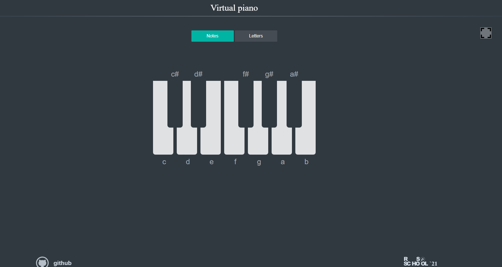

# Virtual piano
 This project shows how to work with audio files in javaScript
## Tools and Libraries
 In this project I use: 
    - Html. 
    - Css. 
    - JavaScript. 
## Usage
    You can click on keys with your mouse or using your keyboard. You can also enter 
    full screen mode clicking square button on the top right of your display.
## Screenshot

## Links
[Source code](https://github.com/mikitapapok/virtualpiano/tree/piano)
 
[deployed project](https://mikitapapok.github.io/virtualpiano/)

